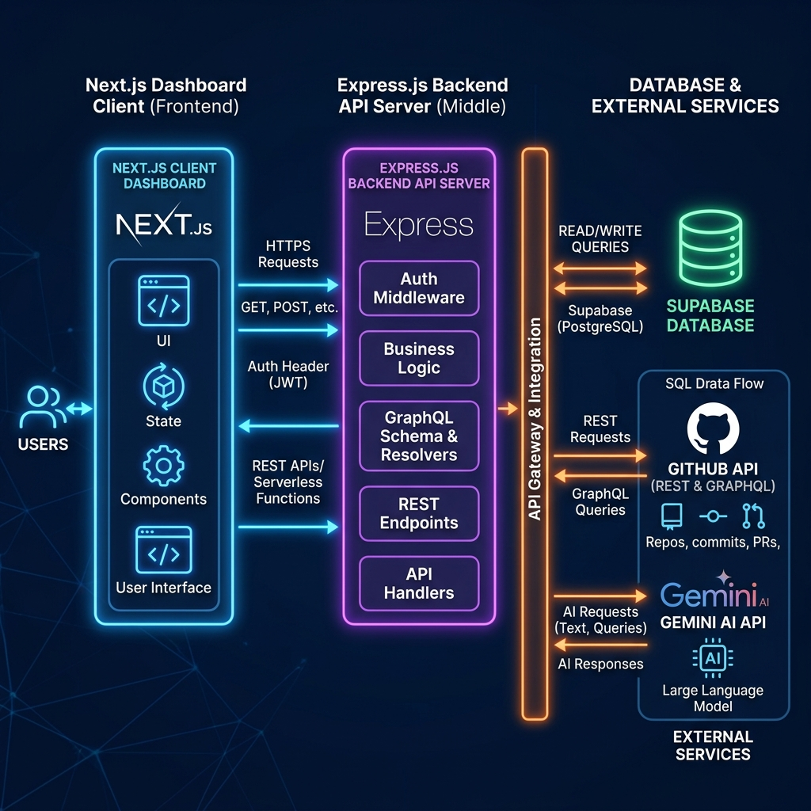
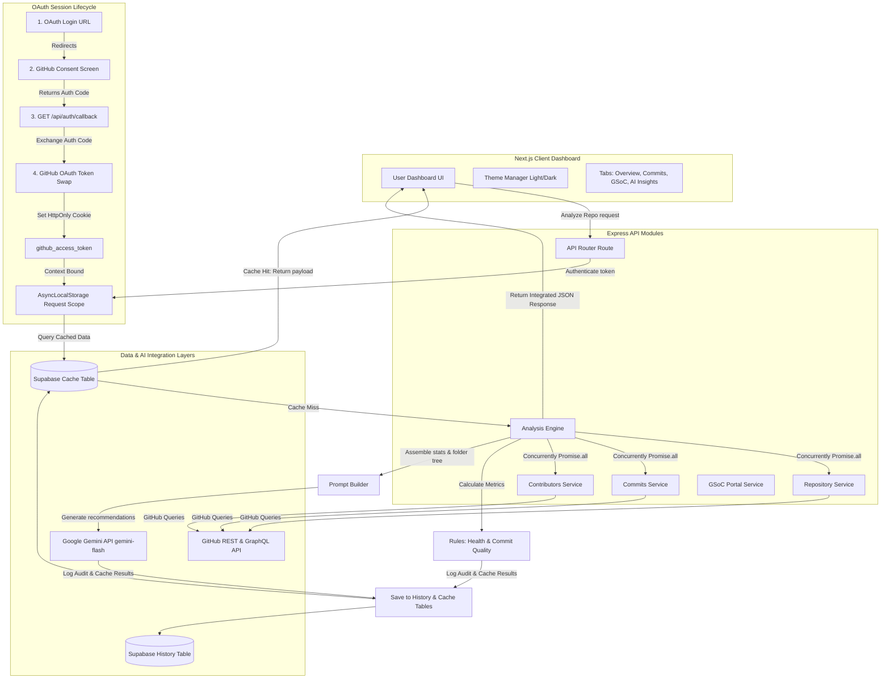
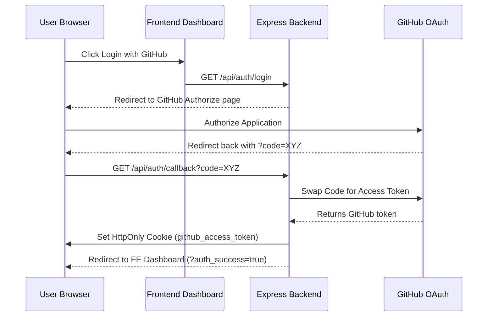

# Architecture Blueprint 📐

This document outlines the high-level architecture, module boundaries, authentication lifecycle, and data flow of **GitPulse Light**.

---

## 🗺️ High-Level System Architecture

GitPulse utilizes a client-server architecture composed of a Next.js Single Page Application (SPA) on the frontend, and a Node.js/Express.js Modular Monolith on the backend, integrated with Supabase for historical storage/caching and GitHub REST/GraphQL APIs for real-time repository extraction.

### 🗺️ System Flow Diagram

---

## 📦 Backend Architectural Boundaries

The backend is structured as a **Modular Monolith** located under `backend/src/modules/`. Each module is encapsulated and owns its business logic, routes, and controllers, preventing spaghetti code dependencies:

1. **`auth` Module:** Coordinates GitHub OAuth 2.0 authentication. Swaps auth codes for GitHub Access Tokens, setting them securely in `HttpOnly` client-side cookies.
2. **`repository` Module:** Extracts top-level repository metadata (stars, forks, license, and primary language) and computes codebase composition maps.
3. **`commits` Module:** Fetches commits, evaluates commit frequencies, and profiles commit timelines (time-of-day/day-of-week).
4. **`contributors` Module:** Extracts the list of contributors and their active commit shares.
5. **`analysis` Module:** Orchestrates health score calculations, commit quality reviews, and interacts with the AI Engine.
6. **`gsoc` Module:** Manages the GSoC accepted organizations and student projects data archive.

### 🧵 Request Context Isolation (Continuation Local Storage)
To support seamless GitHub API calls across multiple users, the backend isolates the active user's GitHub Access Token using Node's native `AsyncLocalStorage` inside `backend/src/shared/context/authContext.js`.
Every incoming request runs within a scoped execution context, making the token globally accessible to the GitHub API client wrapper (`backend/src/shared/client/github.js`) without needing to pass it through every function call.

---

## 🖥️ Frontend Architectural Boundaries

The frontend is a single-page application built on **Next.js** (App Router, Tailwind CSS, TS) located in the `frontend/` directory.

### Core Layout & Components
*   **Routing:** Utilizes Next.js file-based App Router. The primary page (`frontend/src/app/page.tsx`) acts as the parent entry point, wrapping the main [Dashboard](file:///c:/Users/DELL/Desktop/pulse/frontend/src/components/Dashboard.tsx) component.
*   **State Orchestration:** The Dashboard component acts as the global state orchestrator, managing:
    *   Currently active tab (Overview, Commits, GSoC, etc.).
    *   Active repository under analysis (owner and name).
    *   Auth states (logged-in user information, session validation status).
    *   Application theme (toggles `.dark` on `document.documentElement`).

---

## 🔐 Authentication & Session Lifecycle

GitPulse integrates **GitHub OAuth 2.0** with strict security practices:

### Security Measures:
*   **HttpOnly Cookies:** The actual GitHub OAuth token is never exposed to client-side JavaScript, protecting the token from Cross-Site Scripting (XSS) attacks.
*   **Cookie Expiry & Refresh:** Access tokens are managed with short expiration parameters and refreshed seamlessly if session parameters persist.
*   **CORS Policies:** Restricts communication strictly between the configured `FRONTEND_URL` and `FRONTEND_ORIGIN` variables.
