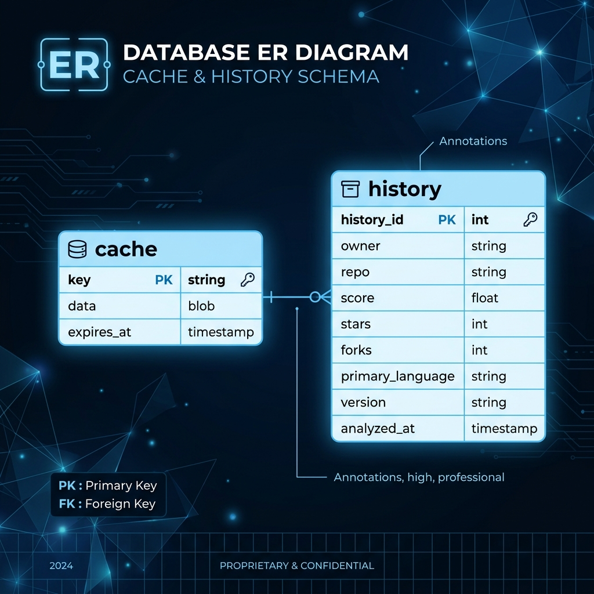
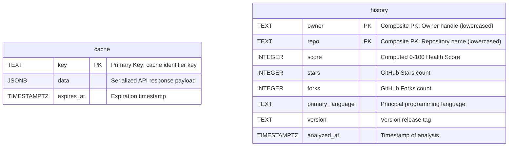
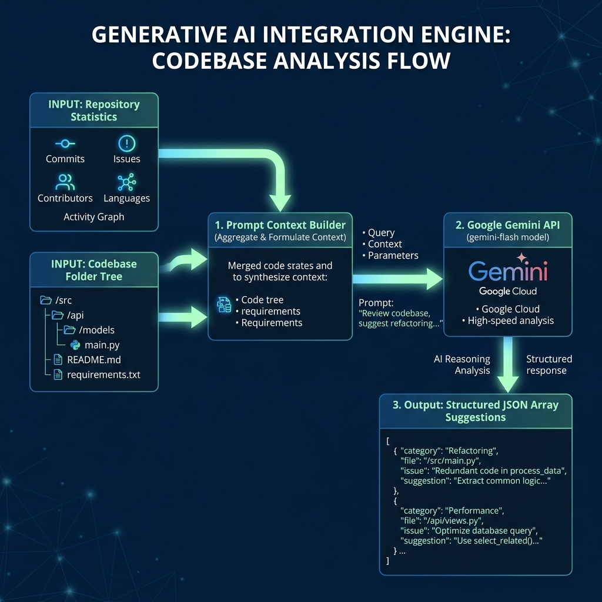

# System Design Specification 🛠️

This document details the system design, database schemas, scoring algorithms, and AI integration systems of **GitPulse Light**.

---

## 💾 Database Schema Design (Supabase)

GitPulse utilizes Supabase as a managed PostgreSQL database for storing analysis query logs (history) and caching external GitHub API payloads.

### 📊 Database ER Diagram




### 1. `cache` Table
Serves as the high-speed cache layer to minimize GitHub API rate limits.
*   **Purpose:** Stores stringified JSON responses of heavy GitHub API calls (e.g. contributor lists, commit frequencies, GSoC data structures).
*   **Schema:**
    | Column Name | PostgreSQL Type | Constraints | Description |
    | :--- | :--- | :--- | :--- |
    | `key` | `TEXT` | `PRIMARY KEY` | Cache identifier (e.g., `gsoc:organizations` or `repo:owner/name`). |
    | `data` | `JSONB` | `NOT NULL` | The serialized payload returned by the source API. |
    | `expires_at` | `TIMESTAMP WITH TIME ZONE` | `NOT NULL` | Expiration timestamp. Checked on read; cleaned up asynchronously on write. |

### 2. `history` Table
Stores a ledger of all analyzed repositories.
*   **Purpose:** Feeds the **Recent Audits** leaderboard and tracks repository analysis histories.
*   **Schema:**
    | Column Name | PostgreSQL Type | Constraints | Description |
    | :--- | :--- | :--- | :--- |
    | `owner` | `TEXT` | `PRIMARY KEY (composite)` | Owner handle of the GitHub repository (lowercased). |
    | `repo` | `TEXT` | `PRIMARY KEY (composite)` | Repository name (lowercased). |
    | `score` | `INTEGER` | `NOT NULL` | Computed 0-100 Health Score. |
    | `stars` | `INTEGER` | `NOT NULL` | Total GitHub stars count at time of audit. |
    | `forks` | `INTEGER` | `NOT NULL` | Total GitHub forks count. |
    | `primary_language` | `TEXT` | `NOT NULL` | Principal development language (e.g. TypeScript). |
    | `version` | `TEXT` | `NULLABLE` | Version release tag (if available). |
    | `analyzed_at` | `TIMESTAMP WITH TIME ZONE` | `DEFAULT NOW()` | The exact timestamp of the analysis. |

---

## 🧮 Core Scoring Algorithms

GitPulse implements two proprietary scoring algorithms to quantify repository quality.

### 1. Health Score (0 - 100)
Calculated inside [healthScore.js](file:///c:/Users/DELL/Desktop/pulse/backend/src/modules/analysis/rules/healthScore.js) as a summation of six distinct metrics:

1.  **README Documentation (15 pts):** Checked via repository content index. If present, awards 15 points.
2.  **Open Source License (5 pts):** Evaluates if a recognized license is attached. If present, awards 5 points.
3.  **Issues Enabled (10 pts):** Confirms if the project allows feedback. If enabled, awards 10 points.
4.  **Contributor Base size (20 pts):** Measures the bus factor:
    *   `>= 10` contributors: 20 points
    *   `>= 5` contributors: 15 points
    *   `>= 2` contributors: 10 points
    *   `1` contributor: 5 points
5.  **Recent Activity (25 pts):** Analyzes commits made over the last 30 days:
    *   `>= 30` commits: 25 points
    *   `>= 10` commits: 20 points
    *   `>= 5` commits: 15 points
    *   `>= 1` commits: 10 points
6.  **Commit Recency (25 pts):** Decays points based on days since last commit:
    *   `<= 7` days: 25 points
    *   `<= 30` days: 20 points
    *   `<= 90` days: 15 points
    *   `<= 180` days: 10 points
    *   `> 180` days: 0 points

---

### 2. Commit Quality Score (0 - 100)
Calculated in [commitQuality.js](file:///c:/Users/DELL/Desktop/pulse/backend/src/modules/analysis/rules/commitQuality.js) by taking the arithmetic mean of 5 metrics:

$$\text{Commit Quality Score} = \frac{\text{Conventional}\% + \text{Length}\% + \text{Imperative}\% + \text{Activity}\% + \text{Recency}\%}{5}$$

*   **Conventional commits percent:** Commits matching standard conventions:
    ```regex
    /^(feat|fix|chore|docs|style|refactor|perf|test|build|ci)(\([a-z0-9_-]+\))?:/i
    ```
*   **Good length percent:** Percentage of messages that are descriptive but concise (between 8 and 74 characters).
*   **Imperative mood percent:** Evaluates if commit messages start with active/imperative verbs:
    ```regex
    /^(add|fix|handle|update|remove|delete|change|implement|make|refactor|set|get|create|run)/i
    ```
*   **Activity percent:** The normalized commit frequency (normalized out of a max baseline of 25 commits).
*   **Recency percent:** The normalized commit recency score.

---

## 🤖 Generative AI Integration Engine

GitPulse utilizes generative AI to provide granular architectural reviews, located in [ai.service.js](file:///c:/Users/DELL/Desktop/pulse/backend/src/modules/analysis/ai.service.js).

### 🤖 Generative AI Flow Diagram


### System Configuration
*   **Model:** `gemini-flash-latest` (configured with `responseMimeType: 'application/json'`).
*   **Inputs:** Receives computed repository statistics alongside the full repository folder structure tree (files and sizes).
*   **Role Prompt:** Initiates the agent as a *Senior Software Architect*.
*   **JSON Schema Enforcement:** Enforces a rigid JSON Array schema where suggestions are typed under `category` (*Workflow, Governance, Quality, or Community*), `urgency`, `aiReasoning`, `impact`, and `actionableStep`.

### Heuristics Fallback Engine
If the `GEMINI_API_KEY` is not present, GitPulse invokes a local rule-based system (`backend/src/modules/analysis/rules/insights.js`) to parse the stats and generate standard recommendations (e.g. suggesting license addition, README expansion, or git hooks for conventional messages), guaranteeing offline functionality.

---

## ⚡ Performance Optimizations

1.  **API Concurrency Orchestration:** When analyzing a repository, GitPulse triggers internal module resolvers concurrently using `Promise.all()` to gather general metadata, commit activity timelines, and contributor lists, saving up to 60% of total HTTP round-trip latency.
2.  **Data Payload Pruning:** The official GSoC archive contains projects going back to 2016. To prevent downloading and transmitting megabytes of telemetry data, the backend controller intercepts the GSoC database and strips down historical objects, forwarding only the years `2024` through `2026` to the client.
3.  **Supabase Caching Engine:** The cache module sets configurable TTL values (default: 1 hour) on resolved external responses, shielding the server from GitHub API rate-limit exhaustion.
